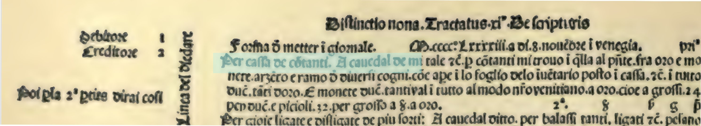
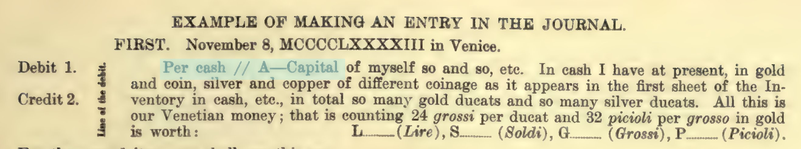

Pacioli writes clearly (see the translation {}) of doing an inventory of the amount of cash you have and then creating a journal entry and then entering in the ledger.  So in Chapter 11:
```
THE TWO EXPRESSIONS USED IN THE JOURNAL, ESPECIALLY IN VENICE, THE ONE CALLED
"PER," AND THE OTHER "A," AND WHAT IS UNDERSTOOD BY THEM.
As we have said, there are two expressions {termini) used in the said Journal;
the one is called "per," and the other is called "a," each of which has a
meaning of For if, in balancing your book, you find that cash is in the credit,
it would denote a mistake in the book, as I will remind you hereafter at its
proper place. Now this entry ought to be made in the Journal, and ought to be
arranged in this way : 43 its own. "Per" indicates the debtor {debitore) one or
more as the case may be, and "a," creditor {creditore) , one or more as the case
may be. Never is any item entered in the Journal which also is to be entered in
the Ledger, without preceding it by one of the two expressions. At the beginning
of each entry, we always provide "per," because, first, the debtor must be
given, and immediately after the creditor, the one separated from the other by
two little slanting parallels {virgolette) , thus, //, as the example below will
show.
```

and in Chapter 12
```
HOW THE ENTRY SHOULD BE MADE INTO THE JOURNAL BY MEANS OF THE DEBIT AND THE
CREDIT, WITH MANY EXAMPLES. THE TWO OTHER EXPRESSIONS USED IN THE LEDGER, THE
ONE CALLED "CASH," AND THE OTHER "CAPITAL," AND WHAT SHOULD BE UNDERSTOOD BY
THEM.
With the name of God you shall begin to enter into your Journal the first item
of your Inventory, that is, the quantity of cash that you possess, and in order
to know how to enter this Inventory into the Ledger and Journal, you must make
use of the two other expressions {termini) ; the one called "cash" {cassa) and
the other "capital" {cavedale). By cash is understood your property or
pocketbook {borscia: from bursa, or bag) ; by capital is understood the entire
amount of what you now possess. This capital must always be placed as creditor
{creditore) in all the principal mercantile Ledgers and Journals and the cash
always debtor. Never at any time in the management of your business may cash be
creditor, but only debtor unless it balances...
```

in the original:



and in Geisjbeck's translation:



So displayed as a diagram X pounds is transferred from Cash to Capital
resulting in a negative Cash Balance and a positive Capital Balance.  The numbers in the boxes represesnt the balance before and after the transfer:


flowchart LR
  {}
  O([Capital 0**→£X**])
  class I classEquity;
  C([Cash 0→**£-X**])
  class C classAssets;
  C --  per // a **£X**--> O


There is an alternative way of looking at it of transferring a liability from
cash to capital:


flowchart LR
  {}
  O([Capital 0→**£-X**])
  class I classEquity;
  C([Cash 0→**£X**])
  class C classAssets;
  C --  per // a **£=X**--> O


After doing a worked example of trading using normal accounting conventions with graphs and it
 just seems wrong and `a bit abitrary` as Tiger Beatle puts it in
[their documentation](https://github.com/tigerbeetle/tigerbeetle/blob/main/docs/coding/financial-accounting.md).  Luca Pacioli's wrote the original textbook in 1494 {} and everyone has copied
 the conventions since.

I think it is wrong rather than just a matter of convention.    There are other good examples in
Science where a convention is found to be oppposite to nature.  For instance the electron has a negative charge so the flow of electrons is in the
opposite sent to which current is meant to flow.  The negative charge was discovered in
[1897 by JJ Thompson](https://en.wikipedia.org/wiki/Electron)

I am theorising that there are two problems which lead to this:

- Not using negative numbers
- Starting with a going concern rather than a fresh one

Not using negative numbers means you need to label the negative numbers.  These have latterly been called Debit and Credit with a loose correspondence to
debitor and creditor.  Pacaioli describes it the in debit as (_in dare_)
and those in credit as (_in havare_)


## Why it doesn't matter

It is confusing to think of it this way but in the end it just complicates
comprehension but does not lead to any error (as you might expect after 500+ years of use).

For modern users it is often hidden.  So for instance the Barclays banking app
uses negative numbers for with drawals from your account and positive numbers for
deposits so that you have a sense of your own statement.  Confusingly from
Barclays bank perspective an increase in customer deposits is an increase in
the banks liabilities and so from their perspect should be considered as negative!
