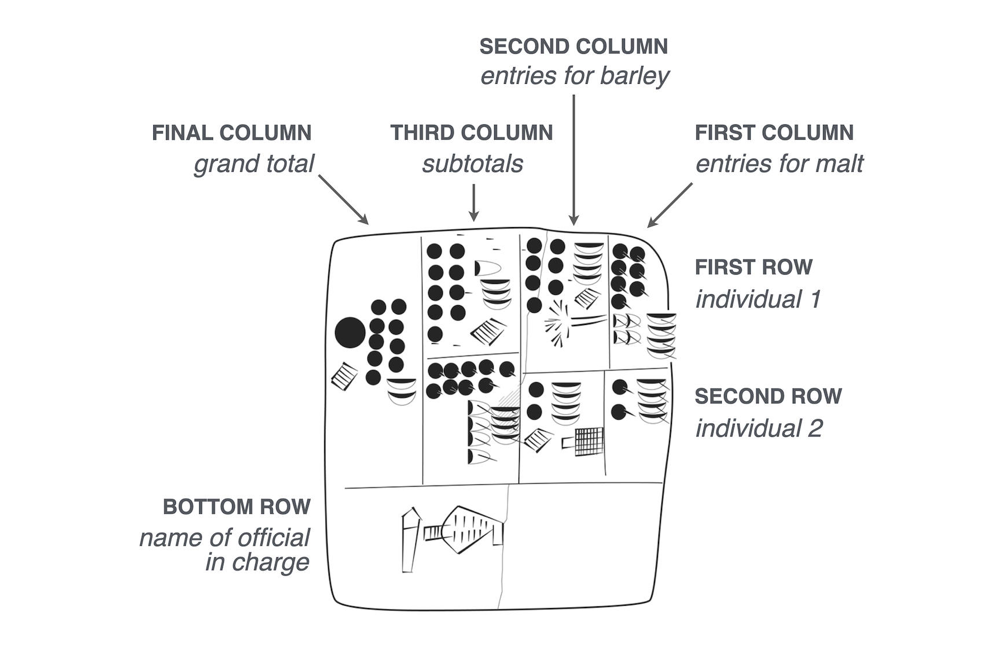

Recording of transactions has been done for a very long time.  The earliest known numerical records, notches on bones are found in the Paleolithic era in [Africa](https://en.wikipedia.org/wiki/Lebombo_bone) and the [Levant](https://arstechnica.com/science/2018/05/notched-gazelle-bones-may-be-the-signature-of-a-paleolithic-culture/) 30- 40,000 years ago.  However it is not clear that they these are records of hunting trips (transactions) but have some other purpose.

When agriculture became more widespread (ca. 10,000 years ago), there was the need to document and manage economic transactions to do with farming, livestock, and the division of labour.
From about 10,000 BP to about 6,000 BP [hollow clay bullae](https://en.wikipedia.org/wiki/Bulla_(seal)) were used to [record transactions](https://www.schoyencollection.com/mathematics-collection/pre-literate-counting/bulla-envelope-ms-4632 transactions).
It is likely that the tokens inside represented amounts of livestock and grain.
The whole sealed amount represents a single transaction.  For instance you could
record the number of sheep given to a shepherd and then make sure the same number were returned.

This then developed from a physical counting system using tokens to a more abstract method of using clay stamps or Cuneiform enscriptions.

In the fourth millennium BC, Mesopotamian cities that traded with far way kingdoms needed to keep such records. Clay tablets recovered from the ancient Sumerian city of Uruk show early yet sophisticated tables. Here is a [drawing](https://posit-dev.github.io/great-tables/blog/design-philosophy/) of one of the recovered tablets, which contains an accounting of deliveries of barley and malt from two individuals for the production of beer.
 transactions

Drawing of clay tablet from Sumerian city of Uruk {}, circa 3200-3000 BC. Uruk III Tablet (MSVO 3, 51, Louvre Museum, Paris, France). Annotated with the meanings of the columns, rows, and cells.

Note that the recovered tablet is meant to be read from right to left. Inside each box is an ideogram (a symbol that represented a word or idea) and a numerical value representing a quantity.

Its structure is where things get super interesting:

    Rows: there are roughly two rows, each corresponding to an individual.
    Columns: the first two columns from the right contain counts of malt (rightmost column) and barley (second rightmost column).
    Subtotals: the third column from the right sums barley and malt within each individual, and the left-most column displays the grand total.

As a bonus, the table has a footer, since the bottom row contains the name of the official in charge.
 transactions
In mycenae there was a lot of trade in oil that was recorded using Linear B on
clay tablets.  For instance the following about an [oil transaction](https://mycenaeanmiscellany.wordpress.com/2018/09/16/linear-b-translated-kn-fp1-6-7-16-and-48/).  The palace had large amphora of oil which were given to artisans to become perfumed oil.

## Cuneiform tablet as transaction

The Cuneiform tablet represents a single transaction from perhaps the temple store to a brewer so
that the amount of beer that is to be received is known.   It highlights a transfer of a physical commodity from one party to another.

It would also help in stock keeping in the temple grain stores.
(eg balances of an account).

So these early records using the technology of the time (clay) record transactions and transfers.  They form, like double entry computing and computer records, the core of accounting.
