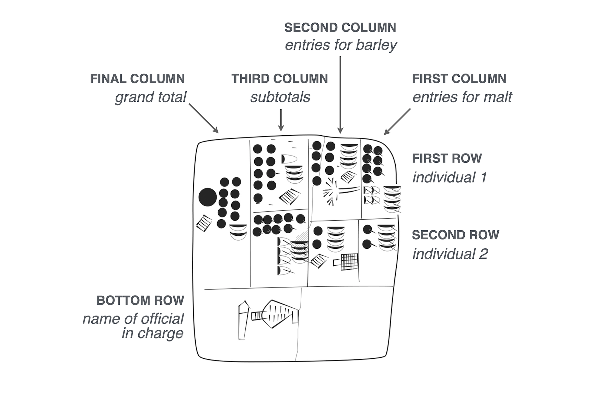

Recording of transactions has been done for [very long time](https://posit-dev.github.io/great-tables/blog/design-philosophy/).

When agriculture became more widespread (ca. 10,000 years ago), there was the need to document and manage economic transactions to do with farming, livestock, and the division of labour. In the fourth millennium BC, Mesopotamian cities that traded with far way kingdoms needed to keep such records. Clay tablets recovered from the ancient Sumerian city of Uruk show early yet sophisticated tables. Here is a drawing of one of the recovered tablets, which contains an accounting of deliveries of barley and malt from two individuals for the production of beer.

Drawing of clay tablet from Sumerian city of Uruk {}, circa 3200-3000 BC. Uruk III Tablet (MSVO 3, 51, Louvre Museum, Paris, France). Annotated with the meanings of the columns, rows, and cells.

Note that the recovered tablet is meant to be read from right to left. Inside each box is an ideogram (a symbol that represented a word or idea) and a numerical value representing a quantity.

Its structure is where things get super interesting:

    Rows: there are roughly two rows, each corresponding to an individual.
    Columns: the first two columns from the right contain counts of malt (rightmost column) and barley (second rightmost column).
    Subtotals: the third column from the right sums barley and malt within each individual, and the left-most column displays the grand total.

As a bonus, the table has a footer, since the bottom row contains the name of the official in charge.

## Cuneiform tablet as transaction

This tablet represents a single transaction from perhaps the temple store to a brewer so
that the amount of beer that is to be received is known. 

It would also help in stock keeping in the temple grain stores. 
(eg balances of an account).
