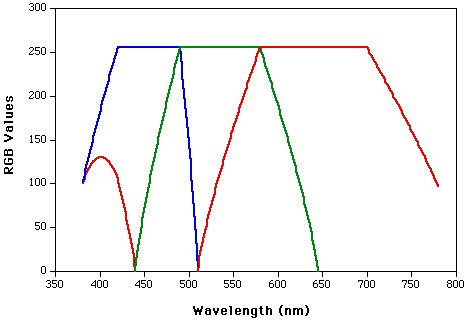

This is my journey to explore colour encoding and perception. There are others who have looked at the same question:

# Colour Encoding

- [Jamie Wong](https://jamie-wong.com/post/color/) Nice graphics
- [Ian Boyd](https://physics.stackexchange.com/questions/94375)  Great answer to question.

 The [spectrum of visible light](https://en.wikipedia.org/wiki/Visible_spectrum) covers the range from violet 380nm to about red 750nm.  The range of colours is seen in rainbows.

A monochromatic source of light appears coloured and the human eye normally has three different colour detectors.  By stimulating them individually you should only need three sources of light to produce any perceived colour combination.

This graph shows a clipped sRGB response for red, green and blue for different monochromatic light sources:

The clipping is because sRGB can only represent a portion of the light sourceThis shows that you could model monochromatic light with 3 monochromatic sources around  440,515 and 650nm.

The perceived colour would then be a function of the number of photons from each source.

###### *Source*[sfasu.edu](http://www.physics.sfasu.edu/astro/color/rgb.gif)
The colour of emitted light is simpler than that of light on a surface as there is no illuminant.  So colour models for displays are simpler. 

This model of display colours is used by the following physical colour space models:

- XYZ
- xyz
- xyY

other models define their coordinates with respect to a white point (or illuminant).

- Lab
- Luv
- HSV
- HSL
- RGB

sRGB is a physical model which references an illumination but is actually independent of it.  It is a clipped representation of a full colour spaces but where it is valid there is a mapping to XYZ space.

# Colour Perception

## Colour cloth, shades, tinting and dyes

When you take a picture of a textile which is woven with a single colour, the colour come from a planar value to black in the cracks of the material.  So the appearance of a textile will be darker in a linear pattern to the black point.

This is similar from having a pure water colour pigment.  With a water colour brush you can never get darker than that colour but with washes you can lighter all the way to the white of the paper.

So the pigment or dye colour is an end point and we could measure emprically shades.

# Links

[Pointers gamut review][]  This is a great article covering pointers gamut and how it fits into perceptual rendering.  Although written in 2015 it also covers differences in monitors and display panels and the ACES standard encoding using floating point.

[Pointers gamut review]:https://tftcentral.co.uk/articles/pointers_gamut

https://chrisbrejon.com/articles/albedo-and-pointers-gamut/

Data from RIT
https://www.rit.edu/science/munsell-color-science-lab-educational-resources

Including [Macbeth Colorchecker data][] which shows in 5nm chunks the reflectance of the Colorcheck patches.

[Macbeth Colorchecker data]:https://www.rit-mcsl.org/UsefulData/MacbethColorChecker.xls

And the [Michael Pointer data set][].

[Michael Pointer data set]: https://www.rit-mcsl.org/UsefulData/PointerData.xls